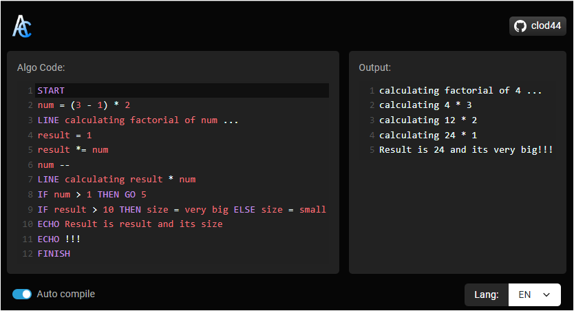

# Algo-Compiler
Compiles the pseudo "algorithm" code and shows the result

[Try it here](#)

## Features

 - [x] Syntax highlight
 - [x] Code Suggestion (Ctrl+space)
 - [x] Language support
 - [x] Realtime Compiling

## What is "algorithm code"
Algorithm code is a pseudo code used to teach fundamentals of programming to beginners in education. Rules and syntax of the language can change in differ. 
```
START
x = 12
y = 3
ECHO x + y
FINISH
``` 
```
> 15
```



## Code
 - `START` - Starts the program. must be added at the beginning of the program
 - `ECHO` - Evaluates and outputs the result
 - `LINE` - Same as ECHO but adds a new line after that
 - `GO` - Makes the program jump to the specified line
 - `IF` - Does X if given Y condition is true. optionaly does Z if given condition is false. Don't add the `ELSE` and `(ifFalseDo)` if other condition is not needed. Usage: `IF (condition) THEN (ifTrueDo) ELSE (ifFalseDo)`
 - `//`- Allows you to add comments to the program. Comments does not effect anything but they still take up lines in the program. '// this is a comment'
 - `FINISH` - Finished the program. mut be added to the end of the program
 - Operations: `-=`, `+=`, `-=`, `*=`, `/=`, `++`, `--`

## Why does this exists
I heard some of my friends were mentioning how it is difficult to study by yourself because you can't execute the code and check your result. So I thought perhaps it would be cool to work on some kind of next-level-garbage-text parser!
 
 